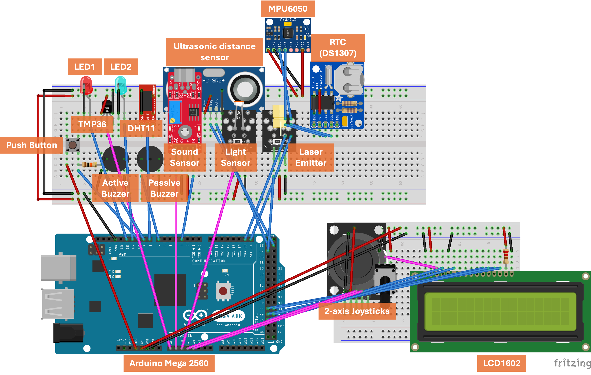

<div align="center">

# Skilled AI Agents for Embedded and IoT Systems Development

[](https://arxiv.org/abs/2603.19583)
[](LICENSE)

Official codebase for the paper: **"[Skilled AI Agents for Embedded and IoT Systems Development](https://arxiv.org/abs/2603.19583)"**.

🌐 Language: **English** | [简体中文](docs/README-CN.md)

</div>

> **At a glance**
> - An AI agent for build embedded/IoT systems code and applications that run on real hardware in one-shot.
> - A comprehensive IoT-SkillsBench for systematically evaluating and comparing agent performance with different *skills* levels.

## 📚 Table of Contents

- [✨ Highlights](#highlights)
  - [🧪 Demos with Setup #1: Arduino Mega 2560 + Arduino](#demo-setup-1)
  - [🧪 Demos with Setup #2: ESP32-S3 + ESP-IDF](#demo-setup-2)
- [🧰 Boards, Frameworks, and Peripherals](#boards-frameworks-peripherals)
- [🗂️ Repository Structure](#repository-structure)
- [⚙️ Installation](#installation)
- [🚀 Quick Start](#quick-start)
- [🛠️ Configuration](#configuration)
- [📊 Evaluation](#evaluation)
- [📚 Citation](#citation)
- [💬 Contact](#contact)

## 📌 Overview

Large language models (LLMs) and agentic systems show immense promise for automated software development. However, applying them to hardware-in-the-loop (HIL) embedded and IoT systems is notoriously difficult due to the tight coupling between software logic, timing constraints, and physical hardware behavior. Code that compiles successfully often fails on real devices. To bridge this gap, we introduce a **skills-based agentic AI framework for embedded and IoT systems development**, and a comprehensive **IoT-SkillsBench**.

<p align="center">
  
</p>

<a id="highlights"></a>

### ✨ Highlights:

- **A skills-based agentic framework** — A principled approach for injecting structured, domain-specific knowledge into LLM-based agents for reliable embedded and IoT systems development.
- **IoT-SkillsBench** — A comprehensive benchmark designed to evaluate AI agents in real-world embedded programming settings, spanning 3 platforms, 23 peripherals, and 42 tasks across 3 difficulty levels.
- **378 hardware-in-the-loop (HIL) experiments** — Each task is evaluated under three agent configurations (no-skills, LLM-generated skills, and human-expert skills) and validated on real, physical hardware, demonstrating that structured human-expert skills achieve near-perfect success rates without reliance on retrieval or long-context reasoning.

<a id="demo-setup-1"></a>

### 🧪 Setup #1: Arduino Mega 2560 + Arduino

💡 Feel free to build your own tasks by creatively combining hardware components from [this peripheral list](docs/atmega2560-arduino-wiring.md) using the wiring diagram below:

<p align="center">
  
</p>

Example Task #1:
```
Set RTC to Mar. 3, 2025 at 14:53:28. 
Then, start collecting MPU6050 measurements every second.
Display the MPU6050 results and date/time on LCD1602 every second.
Also print results to Serial.
```

https://github.com/user-attachments/assets/ca4bb3ee-8449-4271-9f20-643701d79142

Example Task #2:
```
Each time the push button is pressed, capture a measurement from the MPU6050 unit,
and display it on the LCD1602.
Also print the measurement to Serial.
```

https://github.com/user-attachments/assets/3c797eb3-16f1-48ed-b92d-458cca80204c

Example Task #3:
```
Use the joystick to control the laser emitter and passive buzzer.
The joystick's x-axis controls the on/off of the laser emitter.
The joystick's y-axis controls the passive buzzer's tone at intervals of 100 Hz.
```

https://github.com/user-attachments/assets/85ade37b-2ef3-458b-83ae-494acf218387

Example Task #4:
```
Use the ultrasonic distance sensor to measure distance every second.
If the distance is smaller than 1 meter, turn on the laser emitter and passive buzzer.
Set the passive buzzer tone frequency to be proportional to the measured distance.
If the distance is greater than 1 meter, turn off the laser emitter and passive buzzer.
```

https://github.com/user-attachments/assets/49abbc48-8237-4314-81ee-2237478c74d6

<a id="demo-setup-2"></a>

### 🧪 Setup #2: ESP32-S3 + ESP-IDF:

Example Task:
```
Task: "Write the program that will read the password input from the 16-key keypad (password is set to "1234").
If the keypad input matches the password, the program will connect the relay to unlock the safebox.
The program will also display the input password on the LCD1602 display in the format.
```


<a id="boards-frameworks-peripherals"></a>

### 🧰 Boards, Frameworks, and Peripherals

For a complete list of supported boards, frameworks, and peripherals coverage, see:

- [docs/boards-peripherals.md](docs/boards-peripherals.md)

This document helps you quickly choose compatible hardware combinations when creating new tasks.


---


## 🗂️ Repository Structure

```
.
├── docs/                         # Documentation and assets
│   ├── assets
│   └── ...
├── scripts/
│   ├── batch_run.py              # Batch task execution
│   ├── auto_test.py              # Automated compile-and-retry (Arduino only)
│   └── run_task_single.py        # Run a single task
├── skills-human-expert/          # Curated human-expert skills
├── skills-llm-generated/         # LLM-generated skills
├── src/                          # Agentic framework (e.g., based on LangGraph)
│   ├── ...
│   └── ...
├── tasks/                        # Task definitions per board/framework
│   ├── level1/
│   ├── level2/
│   ├── level3/
│   └── single/
│       └── tmp_task.txt          # Example task for testing the agent
├── output/                       # Generated code and metadata (created at runtime)
├── config.template.yaml          # Configuration template (copy to config.yaml)
├── config.yaml                   # Local configuration — DO NOT commit
└── .env                          # Local API keys — DO NOT commit
```

---

## ⚙️ Installation

**Prerequisites:** Python 3.9+

1. **Clone the repository:**

```bash
git clone https://github.com/YOUR_ORG/YOUR_REPO.git
cd YOUR_REPO
```

2. **Install dependencies:**

```bash
pip install -r requirements.txt
```

Key dependencies include LangChain, LangGraph, and the relevant LLM provider SDKs. See `requirements.txt` for the full list.

3. **Set up your API key:**

Create a `.env` file in the project root:

```dotenv
OPENROUTER_API_KEY=your_key_here
```

This file is listed in `.gitignore` and should never be committed.

4. **Create your local configuration:**

```bash
cp config.template.yaml config.yaml
```

Edit `config.yaml` for your environment. The template contains all available options and their defaults — see [Configuration](#configuration) for details.

Hardware-in-the-loop evaluation additionally requires a supported board and the corresponding toolchain (see [Evaluation](#evaluation)).

---

## 🚀 Quick Start

After completing the [Installation](#installation) steps, run a task:

### Single task run (`tasks/single/tmp_task.txt`):

```bash
python scripts/run_task_single.py -o scripts/tmp_output
```

### Batch run (benchmark file + task id):

```bash
python scripts/batch_run.py -i tasks/level3/level3-ATmega2560-Arduino.txt -t Safe_Box_with_display
```

Output is written to：
```
output/tasks-{board}-{framework}/w_skills_{skills_dir}/{model.name}/{task_id}/
```

---

## 🛠️ Configuration

All settings are controlled through `config.yaml`, created by copying `config.template.yaml` (see [Installation](#installation)).

### 🧩 Skills

Enable or disable skill injection, and select the skill set:

```yaml
graph:
  use_skills: true
  skills_dir: skills-human-expert/   # or skills-llm-generated/
  auto_pin_mapping: true             # Arduino only; uses default pin map if task does not specify pins
```

### 🧠 Graph Options

| Key | Type | Description |
|---|---|---|
| `use_skills` | `bool` | Enable skill injection during planning/coding. |
| `skills_dir` | `str` | Skill set directory (`skills-human-expert` or `skills-llm-generated`). |
| `auto_pin_mapping` | `bool` | If `true`, include `pin_mapper` fallback when Arduino task omits pin assignments. |

### 🧱 Board and Framework

Select the target embedded platform:

```yaml
input:
  board: esp32_s3_box_3
  framework: ESP-IDF
```

Supported combinations:

| Board                  | Framework |
|------------------------|-----------|
| `esp32_s3_box_3`       | ESP-IDF   |
| `arduino_mega_2560`    | Arduino   |
| `arduino_nano_33_ble`  | Zephyr    |

### 🤖 Model

Specify the LLM used for code generation:

```yaml
model:
  name: "claude-sonnet-4-5"
```

### 📦 Expected Run Outputs

Each run creates:

- Generated source under run-specific output directory
- `manifest.lock.json` (artifact manifest)
- `metadata.json` (task/config/token usage)
- `debug.json` (per-node debug traces)

---

## 📊 Evaluation

### 🔌 Build and Flash

After code generation, the output must be compiled and flashed to the target board using the platform's native toolchain. Please refer to each platform's official documentation for detailed setup and usage:

- **ESP-IDF** — [ESP-IDF Get Started](https://docs.espressif.com/projects/esp-idf/en/latest/esp32/get-started/)
- **Arduino** — [Arduino CLI Documentation](https://arduino.github.io/arduino-cli/latest/)
- **Zephyr** — [Zephyr Getting Started Guide](https://docs.zephyrproject.org/latest/develop/getting_started/index.html)

As an example, for an Arduino Mega on macOS:

```bash
# Compile and upload
arduino-cli compile --upload --port /dev/cu.usbmodemxxxx --fqbn arduino:avr:mega ./

# Open serial monitor
arduino-cli monitor -p /dev/cu.usbmodemxxxx --config 115200
```

For Arduino targets, an automated compile-and-retry script is also available — see `scripts/auto_test.py`.

### 🧮 Token Usage

Each run produces a `metadata.json` in the output directory with per-node and aggregate token counts:

```json
{
  "token_usage": {
    "per_node": [
      {"node": "manager", "usage": {"input_tokens": 512,  "output_tokens": 89,   "total_tokens": 601}},
      {"node": "coder",   "usage": {"input_tokens": 2048, "output_tokens": 1500, "total_tokens": 3548}}
    ],
    "total_input_tokens": 2560,
    "total_output_tokens": 1589,
    "total_tokens": 4149
  }
}
```

Token tracking is implemented using [`AIMessage`](https://reference.langchain.com/python/langchain-core/messages/ai/AIMessage) from LangChain Core.

---

## 🩺 Troubleshooting

- **Missing API key error**: confirm `.env` contains `OPENROUTER_API_KEY` and matches `model.api_key_env`.
- **No serial port detected**: verify cable, board selection, and port permissions.
- **Build toolchain issues**: install the matching framework toolchain (ESP-IDF / Arduino CLI / Zephyr).
- **Unexpected pin choices on Arduino**: set `graph.auto_pin_mapping: true` and avoid conflicting pin constraints in task text.
- **Output path confusion**: generated artifacts are under `output/` (not `outputs/`).

---

## 📚 Citation

If you use this code or benchmark in your research, please cite:

```bibtex
@article{li2026skilledaiagentsembedded,
      title={Skilled AI Agents for Embedded and IoT Systems Development}, 
      author={Li, Yiming and Cheng, Yuhan and Ma, Mingchen and Zou, Yihang and Yang, Ningyuan and Cheng, Wei and Li, Hai "Helen" and Chen, Yiran and Chen, Tingjun},
      journal={arXiv preprint arXiv:2603.19583},
      year={2026}
}
```

---

## 📄 License

This project is released under the [Apache 2.0 License](LICENSE).

---

## 💬 Contact

We welcome feedback, collaboration, and contributions.

- 💬 Open an issue for questions or feature requests
